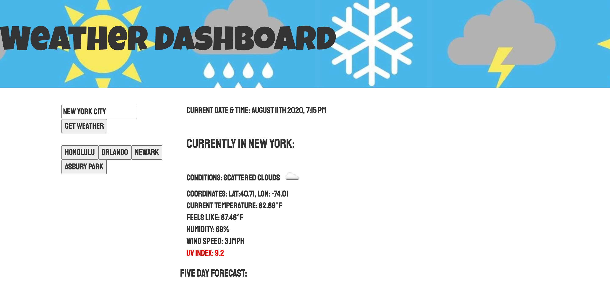

# Weather-Dashboard

For this assignment, we were instructed to create a weather app, pulling information from the OpenWeather API. The user needed to be able to search a city, see the current date's conditions (temperature, humidity, wind speed, uv index), and a 5-day forecast. There also needs to be a search history that will bring back (refreshed) results. Upon click of each button, that city's updated results will appear.


## User Story

```
AS A traveler
I WANT to see the weather outlook for multiple cities
SO THAT I can plan a trip accordingly
```

## TECHNOLOGIES USED:
-HTML\
-CSS\
-JAVASCRIPT\
-JQUERY\
-OpenWeather API\
-moment.js


## LINKS:
-https://github.com/eplatvoet/Weather-Dashboard\
-https://eplatvoet.github.io/Weather-Dashboard/

## SCREENSHOT:

